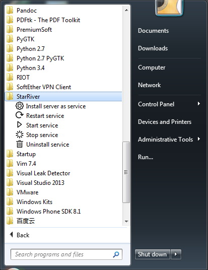

# Start/Stop Server

StarRiver runs in background as a service. You could manually start or stop the service via shortcuts in Start Menu.

Five shortcuts created during installation are:

* **Install server as service**: Install StarRiver Server as a Windows service. This has been done during installation.
* **Restart service**: Manually restart StarRiver service.
* **Start service**: Manually start StarRiver service.
* **Stop service**: Manually stop StarRiver service.
* **Uninstall service**: Remove the StarRiver Windows service. StarRiver communication application will not be removed. But it will no longer starts with the system.
