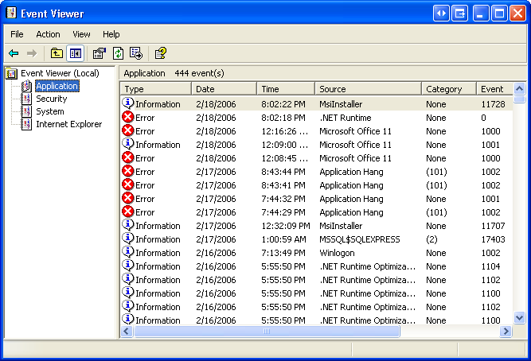
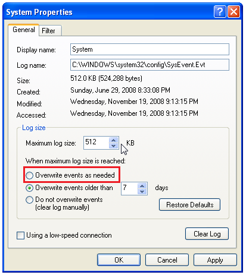

# Troubleshooting

## StarRiver Server service fails to start under Windows XP

A possible cause is that Windows has reached its log size limit. Here is a solution.

1. Open **Control Panel**. Click **Performance and Maintenance**, then click **Administrative Tools**, then double click **Event Viewer**.
2. Right click **Application** under **Event Viewer (Local)**, then select **Properties**.
   
3. In **Application Properties**, inside the **Log size** box, select **Overwrite events as needed**, then click **OK**.
   
4. Repeat step 2 and 3 on **System** under **Event Viewer (Local)**.
