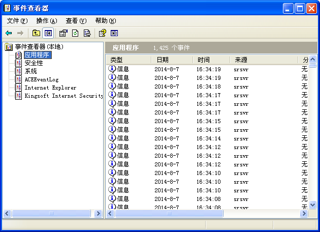
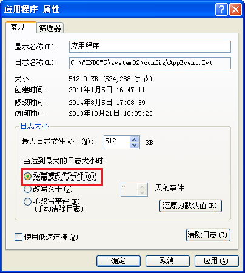

# 故障解决

## Windows XP 下出现 StarRiver Server 服务无法启动

这可能是由于 Windows 日志已满导致。解决方法如下：

1. 打开「控制面板」-「管理工具」-「事件查看器」；
2. 右击「事件查看器（本地）」-「应用程序」，选择「属性」；
   
3. 在「应用程序 属性」-「日志大小」组内，选择「按需要改写事件」，点击确定；
   
4. 用同样的方式修改「系统」的这一属性。
